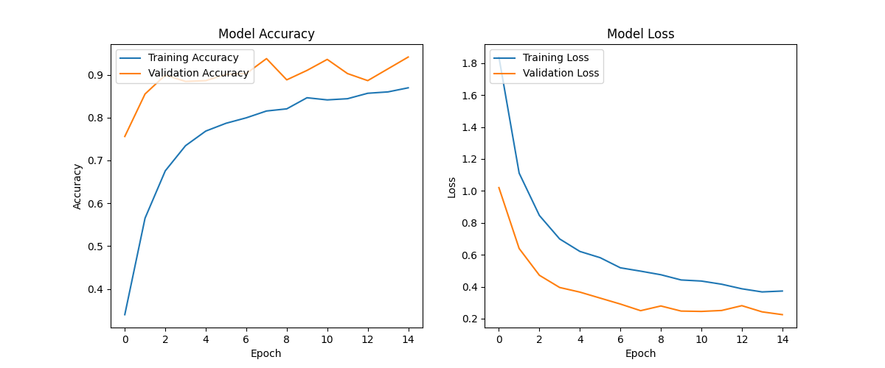

## Real-time Hand Gesture Recognition

This project demonstrates real-time hand gesture recognition using a pre-trained machine learning model and live video input from a camera. It includes scripts for collecting data, training the model, and performing inference for recognizing hand gestures in real-time.

## Project Structure

- `data/` - Directory containing hand gesture images organized by class (e.g., `.data/Goodbye`, `.data/Yes`).
- `dataset_collection.py` - Python script for collecting hand gesture data using a camera.
- `training_classifier.py` - Python script for training a classifier on the collected hand gesture data.
- `inference_classifier.py` - Python script for performing real-time hand gesture recognition using the trained model.
- `model/` - Directory where the trained model files are saved.
- `requirements.txt` - Contains the list of required Python packages.
- `README.md` - This file.

## Scripts Overview

1. **`dataset_collection.py`**: 
   - Collects hand gesture data by capturing images from a camera and extracting hand landmarks using the MediaPipe library.
   - Saves the data in a pickle file (`data.pickle`) for use in training the model.

2. **`training_classifier.py`**: 
   - Trains a machine learning model (such as MobileNetV2 or Random Forest) on the collected hand gesture data.
   - Splits the data into training and testing sets, trains the model, evaluates its performance, and saves the trained model in the `model/` directory.

3. **`inference_classifier.py`**: 
   - Performs real-time inference using the trained model.
   - Captures live video from the camera, detects hand landmarks, predicts the hand gesture using the trained model, and overlays the predicted gesture on the video stream.

## Setup and Requirements

To run these scripts, you need:

- Python 3.x
- OpenCV (`cv2`)
- MediaPipe (`mediapipe`)
- NumPy
- TensorFlow / Keras (`tensorflow`)
- scikit-learn (`sklearn`)

### Install the Required Packages

You can install the required Python packages using:

```bash
pip install -r requirements.txt
```

## Model Training and Performance

### Training and Validation Accuracy

Below is a plot of the training and validation accuracy of the model over 10 epochs. The model uses MobileNetV2 with additional layers and dropout to prevent overfitting.



The training and validation accuracies show that the model generalizes well to unseen data, with validation accuracy stabilizing at around 90%.

## Usage

### 1. Data Collection

Run the `dataset_collection.py` script to capture hand gesture data. Make sure to adjust the `DATA_DIR` variable to specify the directory where the data will be saved.

```bash
python dataset_collection.py
```

### 2. Model Training

Run the `training_classifier.py` script to train a Random Forest classifier or a MobileNetV2 model on the collected data. The trained model will be saved in a file named `model.p`.

```bash
python training_classifier.py
```

### 3. Real-time Inference

Run the `inference_classifier.py` script to perform real-time hand gesture recognition using the trained model. Ensure that the camera index specified in the script matches the correct camera device.

```bash
python inference_classifier.py
```

### Output

The predicted gestures will be displayed on the video stream in real time:


## Extending to Sign Language Translation

This project can be extended for sign language translation of American alphabets. By training the model with hand gestures representing American Sign Language (ASL) alphabets, real-time inference can be used to translate hand gestures into corresponding letters. This can aid communication for individuals who are deaf or hard of hearing.

## Results

- **Training Accuracy**: Approximately 85% after 10 epochs.
- **Validation Accuracy**: Around 90%, indicating strong generalization.

## Contributing

If you have any suggestions or improvements, feel free to submit a pull request.

## License

This project is licensed under the MIT License.

```
